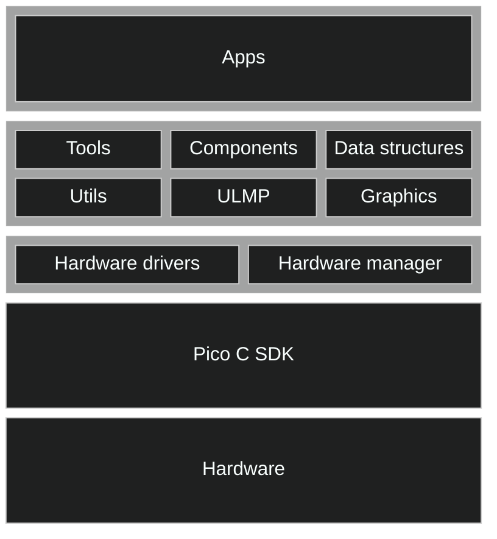
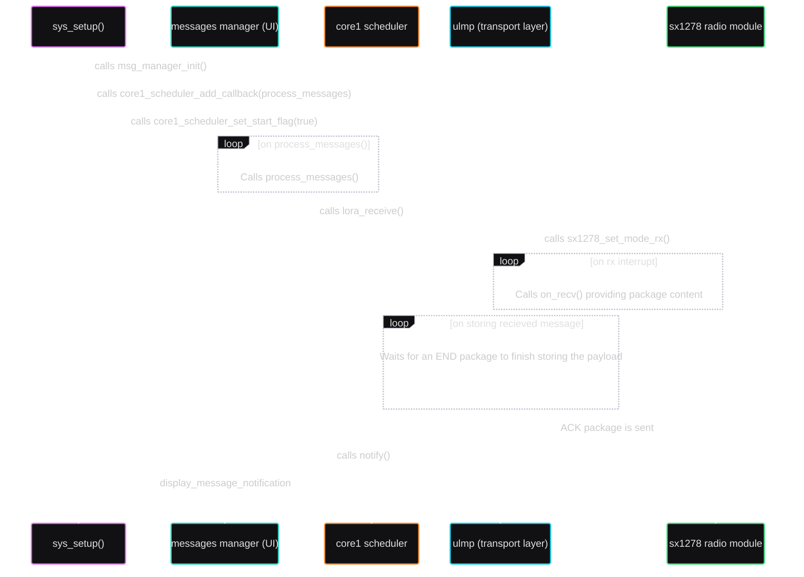
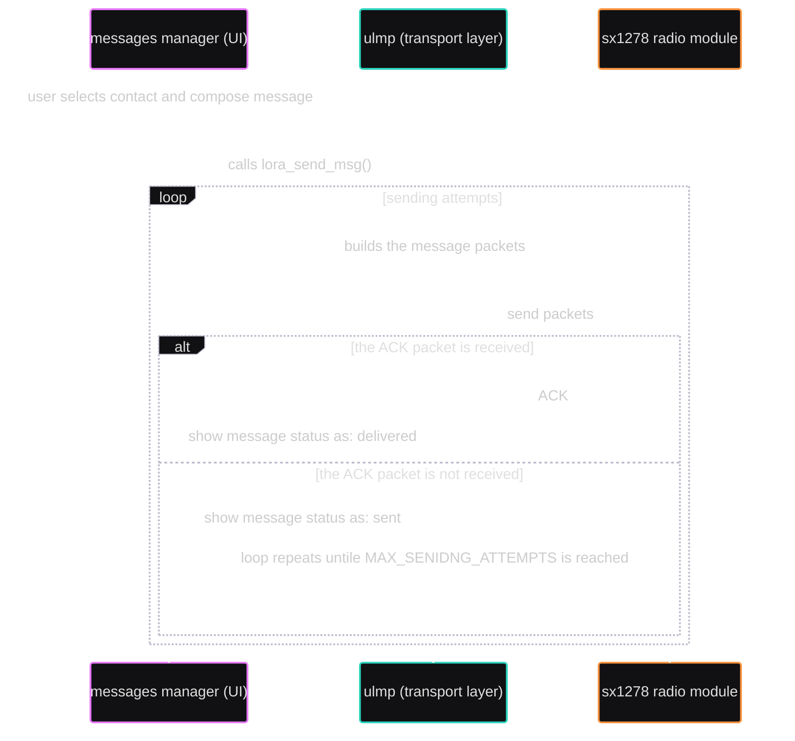
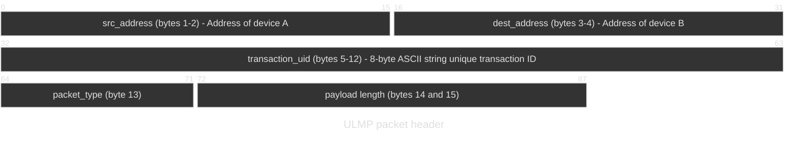

# Watchdog_2040

## Aims

Building a **functional** piece of wearable technology, featuring:

1. ⌚ Time-related functionalities
2. 💬 LoRa text messages transmission
3. 📈 Air quality measurement capabilities
4. 🔧 Easily extendible firmware for future hardware components and capabilities
5. 🚀 A core API system to manage the hardware and provide basic UI elements, for fast app developing

**This project is not, and does not aim to be a smartwatch in the usual sense, for this reason:**

- There is no need to connect it to a smartphone, you already have enough notifications on that.
- Has nothing to do with your fitness routine or exercise tracking.
- Does not have a touch screen, your fingers are too big for that.
- It is not meant to be a fashion accessory, it is a tool (although a cool one).
- It is not meant to be a gaming device, although you can develop some simple games on it (just read Developing apps for the Watchdog_2040 section).

**Other fundamental principles are:**

- Totally **open source hardware and software**.
- Designed to be **easily hackable and extendible**.
- Easy to **fix and maintain**.

## Hardware

photos here

## Firmware

The firmware is written in C and is based on the [Pico SDK](https://github.com/raspberrypi/pico-sdk).

> From here on, when referring to a **`"module"`** (that is not specifically an hardware physical module), it is meant a **`C file with its header file, that provides a specific functionality`**.

Almost all the hardware-related modules are written from scratch, with the exception of the spi SD card driver, that is just a copy of: [https://github.com/carlk3/no-OS-FatFS-SD-SPI-RPi-Pico](https://github.com/carlk3/no-OS-FatFS-SD-SPI-RPi-Pico) embedded in the project under the [core/lib/no-OS-FatFS-SD-SPI-RPi-Pico](core/lib/no-OS-FatFS-SD-SPI-RPi-Pico) directory, this great library makes all the heavy lifting for the SD card read/write operations and the FAT filesystem management.

The sx1278 LoRa driver is just a C port I made from the [ulora micropython library](https://github.com/armanghobadi/ulora)

The code is divided into two mains subfolders: `core` and `apps`, the first one contains all the necessary modules to make the hardware work and provides a set of APIs to create basic user interfaces, the second one contains the applications that run on top of the core modules.

### Project overview

The following diagram shows the firmaware architecture by layers:



The Layers will be named like this:

- **`Core`**:
  - **layer 0**: the hardware drivers and their management (the third block from the top of the diagram)
  - **layer 1**: the core API and the ULMP stack (the second block from the top of the diagram)
- **`Apps`** (the top block of the diagram)

### Core - layer 0: the hardware drivers and their management

#### Hardware drivers

All the hardware drivers are located in the `core/hardware_drivers` folder, here is a list of the available drivers:

- **`battery`** for battery management and monitoring, available including [`core/hardware_drivers/battery.h`](core/hardware_drivers/battery.h).
- **`core1`** for core1 management, available including [`core/hardware_drivers/core1.h`](core/hardware_drivers/core1.h).
- **`ens160`** for the ENS160 air quality sensor, available including [`core/hardware_drivers/ens160.h`](core/hardware_drivers/ens160.h).
- **`haptics`** for haptic feedback control, available including [`core/hardware_drivers/haptics.h`](core/hardware_drivers/haptics.h).
- **`joystick`** for joystick control, available including [`core/hardware_drivers/joystick.h`](core/hardware_drivers/joystick.h).
- **`onboard_led`** for onboard LED control, available including [`core/hardware_drivers/onboard_led.h`](core/hardware_drivers/onboard_led.h).
- **`rtc_time`** for RTC time management, available including [`core/hardware_drivers/rtc_time.h`](core/hardware_drivers/rtc_time.h).
- **`sdcard`** for SD card management (built on top of [https://github.com/carlk3/no-OS-FatFS-SD-SPI-RPi-Pico](https://github.com/carlk3/no-OS-FatFS-SD-SPI-RPi-Pico)), available including [`core/hardware_drivers/sdcard.h`](core/hardware_drivers/sdcard.h).
- **`ssd1306`** for SSD1306 OLED display control, available including [`core/hardware_drivers/ssd1306.h`](core/hardware_drivers/ssd1306.h).
- **`sx1278`** for SX1278 LoRa transceiver control, available including [`core/hardware_drivers/sx1278.h`](core/hardware_drivers/sx1278.h).

Almost all hardware drivers are structured like this:

- A `<peripheral_name>_init(<args>)` function to initialize the hardware, returning a pointer to the hardware struct.
- One or more `<peripheral_name>_<action>(<peripheral_struct_pointer>)` functions to perform actions on the hardware.

This was done to provide a simple and extensible hardware abstraction layer, where you can plug, let's say, a second joystick or screen by just initializing a new one and storing it in the [**`drivers`** struct](#drivers-struct-and-hw_manager).

> Exception was made for `haptics` and `onboard_led` drivers, due to their simplicity, and for `core1` driver, as it is used to manage the second core of the RP2040 (not a peripheral).

#### Drivers struct and hw_manager

The drivers struct is defined inside [`core/components/hw_manager.h`](core/components/hw_manager.h) and is used to store all the initialized hardware drivers, so they can be easily accessed from anywhere in the code, here is a code snippet showing the drivers present right now for this project:

```c
#include "core/components/hw_manager.h"

drivers->air_quality_sensor // pointer to the air quality sensor driver struct
drivers->oled_screen   // pointer to the screen driver struct
drivers->lora_module // pointer to the lora module driver struct
drivers->battery // pointer to the battery driver struct
drivers->joystick // pointer to the joystick driver struct
drivers->sd_card // pointer to the sd card driver struct
drivers->rtc // pointer to the rtc driver struct
```

> *drivers* is just the name of the global pointer to the singleton instance of *hw_manager* struct

The hardware drivers are initialized when the [**`sys_setup`**](Watchdog_2040.c) function is called in the firmware entry point ([Watchdog_2040.c](Watchdog_2040.c)), trought the call of the [**`hardware_drivers_init`**](core/components/hw_manager.h) function
, that initializes all the hardware drivers and stores their pointers in the `drivers` struct.

> The hardware manager also exposes important functions to get system stats (free heap memory, temperature of the chip etc...), and performs an hardware check at startup, visible on the screen when the device is powered on.

### Core - layer 1: the core API and the ULMP stack

On top of the hardware-related code, there is a set of modules

- **`components`**
- **`utils`** for utility functions used all around the project, available including [`core/utils/utils.h`](core/utils/utils.h).

### The ULMP stack

**`ULMP (Uncomplicated LoRa Messaging Protocol)`** is the transport layer built on top of the sx1278 driver to provide a simple and reliable way to send and receive messages over LoRa.

For "ulmp stack" is meant the software pieces that works together to provide lora messaging functionalities, this includes:

- The sx1278 driver, located in [`hardware_drivers`](core/hardware_drivers)
- The ulmp protocol implementation, located in [`core/ulmp`](core/ulmp)
- The messages manager located in [`apps/msg_manager`](apps/msg_manager)

#### Overview of a message transaction (receive)

--------------------------------



#### Overview of a message transaction (send)

--------------------------------

The diagram below shows the flow of a message transaction when sending a message:



#### The Transport Layer

--------------------------------

Let's see, more in detail, how the transport layer works.

The protocol is designed to be simple and easy to use,
it allows peer to peer or broadcast communication between
two or more sx1278 enabled devices on the same frequency.

##### Packets

There are 6 types of packets that can be sent over the network:

  |NAME       |HEX  |DESCRIPTION
  |-----------|-----|-----------------------------------
  |**`PING`** |0x00 |Used to **check** if a device is still connected to the network.
  |**`PONG`** |0x01 |Used to **respond** to a ping packet.
  |**`START`**|0x02 |Used to **start** a message transaction.
  |**`END`**  |0x03 |Used to **end** a message transaction.
  |**`MSG`**  |0x04 |Used to **send** a string message from one device to another.
  |**`ACK`**  |0x05 |Used to **acknowledge** the receipt of a message.

> All packets have a header and a payload, but only the MSG packet has a non-empty payload.

##### Packets header



Let's see the header structure:

  |BYTES                   |FIELD           |DESCRIPTION
  |------------------------|----------------|-----------------------------------
  |**`BYTES 1 and 2`**     | src_address    | The address of device A.
  |**`BYTES 3 and 4`**     | dest_address   | The address of device B.
  |**`BYTES from 5 to 12`**| transaction_uid| A unique identifier for the whole transaction, a string of 8 bytes.
  |**`BYTE  13`**           | packet_type   | (PING, PONG, START, END, MSG, ACK).
  |**`BYTES 14 and 15`**     | payload_len    | The length of the message in bytes.

##### A transaction example

Device **A** sends a message to device **B**:

1. Device **A** sends a START packet to device **B**,

2. Device **B** receives the START packet and, if it is the intended recipient,
  it allocates the structures to store the message and waits for the next packets to arrive.

3. Device **A** sends one or more MSG packets to device **B**, each containing a part of the message.

4. Device **B** receives the MSG packets and, if it is the intended recipient,
  it reads the payload, storing it in the message structure.

5. Device **A** sends an END packet to device **B**, indicating that the message has been fully sent.

6. Device **B** receives the END packet and, if it is the intended recipient, it reads the message structure
  and processes the message.

7. Device **B** sends an ACK packet to device **A**, indicating that the message has been fully received.

8. Device **A** receives the ACK packet from device **B** and its' happy.

>Let's see the entire transaction in decoded bytes when device **A** sends a long text message to device **B**.

**`\x00\x00\x01\x00QPYQPYQA\x02\x00\x00`**
This is a `START` packet as we can see by the packet type byte **0x02**:

- the source address is **`0x0000`** (device **A** wich has address 0 (decimal)),
- the destination address is **`0x0100`** (device **B** wich has address 1 (decimal)),
- the transaction_uid is **`QPYQPYQA`**,
- the payload length is **`0x0000`** (0 bytes), as this is a START packet.

**`\x00\x00\x01\x00QPYQPYQA\x04\xd7\x00`** On the other hand, we denounce with righteous indignation and dislike men who are so beguiled and demoralized by the charms of pleasure of the moment, so blinded by desire, that they cannot foresee the pain and trou

>This is a `MSG` packet as we can see by the packet type byte **0x04**:

- the source address is **`0x0000`** (device **A** wich has address 0 (decimal)),
- the destination address is **`0x0100`** (device **B** wich has address 1 (decimal)),
- the transaction_uid is **`QPYQPYQA`**,
- the payload length is **`0x00d7`** (215 bytes),
- the payload is the message.

>The next 3 packets are MSG packets with the same transaction_uid and the same source and destination addresses, but with different payloads (and thus different payload lengths):

**`\x00\x00\x01\x00QPYQPYQA\x04\xd7\x00`** ble that are bound to ensue; and equal blame belongs to those who fail in their duty through weakness of will, which is the same as saying through shrinking from toil and pain. These cases are perfectly simple and e'

**`\x00\x00\x01\x00QPYQPYQA\x04\xd7\x00`** asy to distinguish. In a free hour, when our power of choice is untrammelled and when nothing prevents our being able to do what we like best, every pleasure is to be welcomed and every pain avoided. But in certain

**`\x00\x00\x01\x00QPYQPYQA\x04\xd7\x00`** circumstances and owing to the claims of duty or the obligations of business it will frequently occur that pleasures have to be repudiated and annoyances accepted. The wise man therefore always holds in these matter

**`\x00\x00\x01\x00QPYQPYQA\x04\x88\x00`** s to this principle of selection: he rejects pleasures to secure other greater pleasures, or else he endures pains to avoid worse pains.

>This is an `END` packet as we can see by the packet type byte **0x03**:

**`\x00\x00\x01\x00QPYQPYQA\x03\x00\x00`**

Here our transaction ends, the message has been fully sent.

## License

This project is licensed under the MIT License - see the [LICENSE](LICENSE) file for details.
