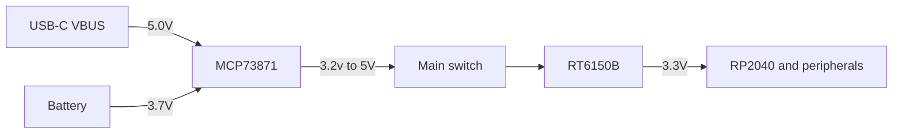
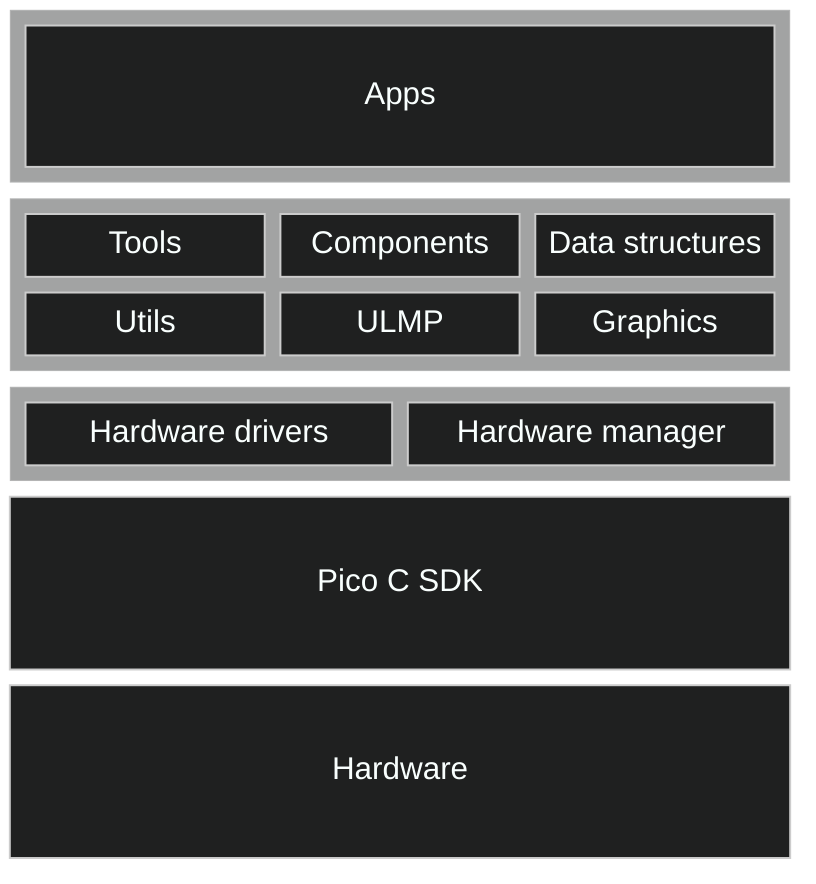
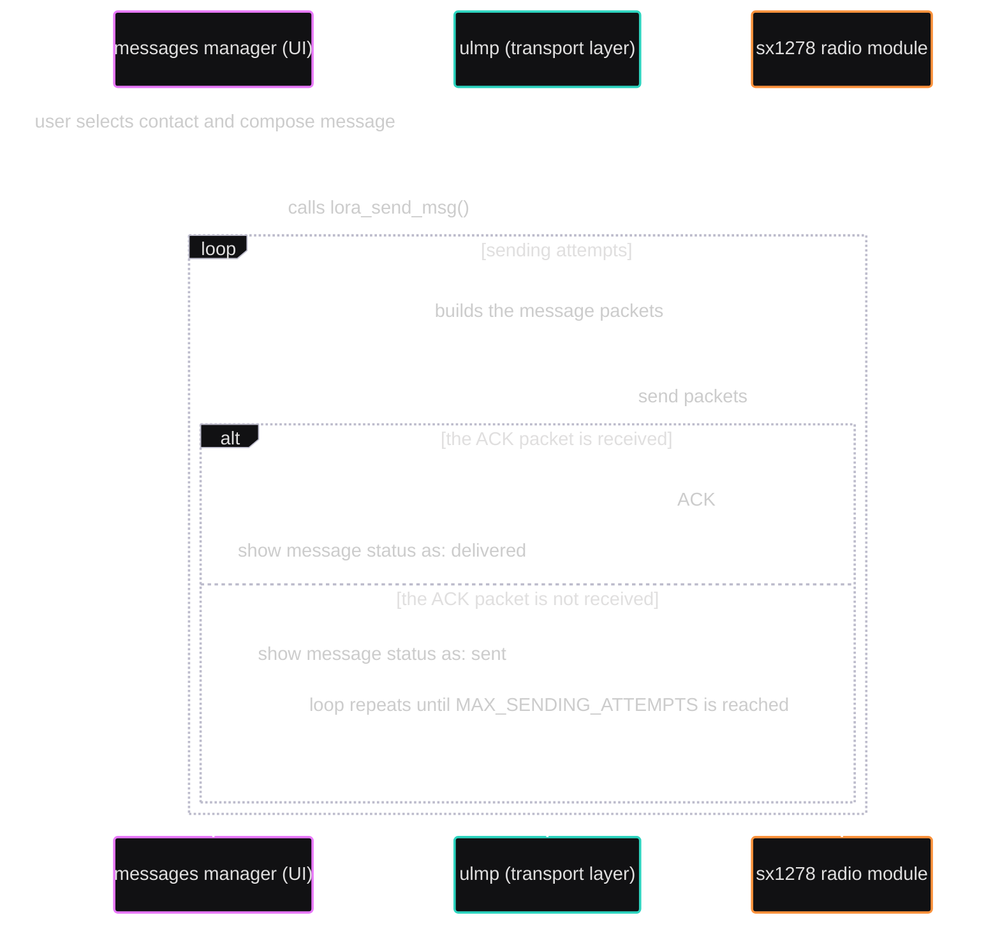
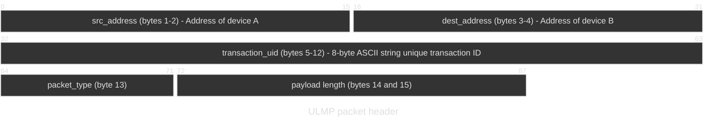
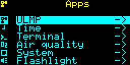
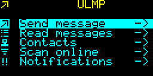

<!-- markdownlint-disable MD024 -->
# Watchdog_2040

## Aims

Building a **functional** piece of wearable technology, featuring:

1. ⌚ Time-related functionalities
2. 💬 LoRa text messages transmission
3. 📈 Air quality measurement capabilities
4. 🔧 Easily extendible firmware for future hardware components and capabilities
5. 🚀 A core API system to manage the hardware and provide basic UI elements, for fast app developing

**This project is not, and does not aim to be a smartwatch in the usual sense, for this reason:**

- There is no need to connect it to a smartphone, you already have enough notifications on that.
- Has nothing to do with your fitness routine or exercise tracking.
- Does not have a touch screen, your fingers are too big for that.
- It is not meant to be a fashion accessory, it is a tool (although a cool one).
- It is not meant to be a gaming device, although you can develop some simple games on it (just read Developing apps for the Watchdog_2040 section).

**Other fundamental principles are:**

- Totally **open source hardware and software**.
- Designed to be **easily hackable and extensible**.
- Easy to **fix and maintain**.

## Table of contents

- [Aims](#aims)
- [History](#history)
- [Hardware](#hardware)
  - [Microcontroller choice](#microcontroller-choice)
  - [Battery and power path](#battery-and-power-path)
  - [Peripherals](#peripherals)
    - [Notes](#notes)
- [Firmware](#firmware)
  - [Project overview](#project-overview)
  - [Core - layer 0: the hardware drivers and their management](#core---layer-0-the-hardware-drivers-and-their-management)
    - [Hardware drivers](#hardware-drivers)
    - [Drivers struct and hw_manager](#drivers-struct-and-hw_manager)
  - [Core - layer 1: the core API and the ULMP stack](#core---layer-1-the-core-api-and-the-ulmp-stack)
    - [The ULMP stack](#the-ulmp-stack)
      - [Overview of a message transaction (receive)](#overview-of-a-message-transaction-receive)
      - [Overview of a message transaction (send)](#overview-of-a-message-transaction-send)
      - [The Transport Layer](#the-transport-layer)
        - [Packets](#packets)
        - [Packets header](#packets-header)
        - [A transaction example](#a-transaction-example)
- [Apps](#apps)
  - [AQI](#aqi)
    - [Dependencies](#dependencies)
  - [Flashlight](#flashlight)
    - [Dependencies](#dependencies-1)
  - [Messaging](#messaging)
    - [Dependencies](#dependencies-2)
  - [Notes](#notes-1)
    - [Dependencies](#dependencies-3)
  - [Password manager](#password-manager)
    - [Dependencies](#dependencies-4)
  - [System app](#system-app)
    - [Dependencies](#dependencies-5)
  - [Terminal](#terminal)
    - [Dependencies](#dependencies-6)
  - [Text editor](#text-editor)
    - [Dependencies](#dependencies-7)
  - [Time](#time)
    - [Dependencies](#dependencies-8)
  - [Todo](#todo)
    - [Dependencies](#dependencies-9)
  - [Virtual keyboard](#virtual-keyboard)
    - [Dependencies](#dependencies-10)
- [Developing apps for the Watchdog_2040](#developing-apps-for-the-watchdog_2040)
  - [Prerequisites](#prerequisites)
  - [From idea to requisites](#from-idea-to-requisites)
    - [The core API system](#the-core-api-system)
      - [CRUD List API](#crud-list-api)
      - [Options Generator API](#options-generator-api)
      - [Launcher API](#launcher-api)
      - [Integration Patterns](#integration-patterns)
      - [Path and File System API](#path-and-file-system-api)
      - [Utils API](#utils-api)
      - [System Paths Manager API](#system-paths-manager-api)
      - [Hardware Manager API](#hardware-manager-api)
      - [Graphical Programming API](#graphical-programming-api)
      - [Graphic Primitives API](#graphic-primitives-api)
      - [Layout System API](#layout-system-api)
      - [Graphs API](#graphs-api)
      - [Advanced Usage Patterns](#advanced-usage-patterns)
- [License](#license)

## History

The **Watchdog_2040** started as a vague idea in my mind around late 2024, I wanted to build a hackable super geeky wearable that can do all sorts of tasks, also being a reliable piece of tech, with enough battery life and stability, a real-life-proof device.
With very low skills in embedded C and PCB prototyping I built them along the way and got this work and perform like a real product in April 2026, with no shortcuts.

## Hardware

### Microcontroller choice

The microcontroller I've chosen for this project is - quite obviously as the name suggests - the `Raspberry Pi RP2040`.
There are several reasons:

1) Great documentation and support, both hardware design and C SDK is perfectly documented, no hours digging into impossible datasheets.
2) Great market availability, good pricing, the device is easy to find and the price is reasonable.
3) Direct interface with USB trough 27 ohm terminating series resistors.
4) Dual core, perfect for a swiss army knife device with notifications, background routines and parallel-demanding stuff
5) Lot of I/O pins, and every needed interface (SPI, I2C, PWM, ADC ...)

The only downside I found for this chip is that its not quite suited for really low-energy applications, not the best for a wearable, although with some battery-saving tricks I reached about 30hrs idle time with occasional usage (the way it should be used), using a 420mAh 3.7V LiPo battery.

### Battery and power path

As I just mentioned, the device is equipped with a `420mAh 3.7V LiPo battery`, small enough to fit into a wearable, big enough to power it for 24+ hrs, under real-life conditions, it sticks around **30** hours.

To handle battery power recharge and discharge, an `MCP73871` IC was added to the design, this nice little device takes gentle care of the battery, also talking with the RP2040 over the **PG**, **STAT1** and **STAT2** pins to communicate the battery status (charging, charge complete, power connected).
The MCP73871 can also automatically handle the main power source coming from the USB plugged in, effectively commuting the power source at need.

To reach a stable voltage of **3.3V** (needed by the RP2040 to work properly) the `RT6150B` Buck-Boost converter chip was fit between the MCP73871 output and the microcontroller 3.3V input pins.

The main switch, a trough hole bipolar slide switch, handles the power on-off of the whole system, exception made for the MCP73871 and the battery, that are connected together and to the USB VBUS.


*Diagram 1 – Power path overview*

### Peripherals

The device is equipped with the following peripherals:


| NAME                            | INTERFACE                              | USAGE                                                      | SMD/THT | MODULE/SINGLE COMPONENT | SOCKET/SOLDERED | EASY-REPLACE             | HOT SWAPPABLE |
|---------------------------------|----------------------------------------|------------------------------------------------------------|---------|-------------------------|-----------------|--------------------------|---------------|
| `SSD1306`                       | I2C                                    | Main screen                                                | THT     | MODULE                  | SOCKET          | YES                      | YES           |
| `ENS160`                        | I2C                                    | Air quality sensor                                         | THT     | MODULE                  | SOCKET          | YES                      | YES           |
| `SX1278`                        | SPI                                    | LoRa radio module                                          | THT     | MODULE                  | SOCKET          | YES                      | YES           |
| `MicroSD`                       | SPI                                    | Persistent data storage                                    | SMD     | SINGLE COMPONENT        | SOCKET          | YES                      | NO            |
| `Analog joystick + push button` | X2 Analog inputs (ADC) + digital input | Input device                                               | SMD     | SINGLE COMPONENT        | SOCKET          | YES                      | NO            |
| `DS3231 RTC + backup battery`   | I2C                                    | Keeps the time when device is off                          | SMD     | SINGLE COMPONENT        | SOLDERED        | NO (YES for the battery) | NO            |
| `Photoresistor`                 | Analog input (ADC)                     | Modulates the screen brightness according to ambient light | THT     | SINGLE COMPONENT        | SOLDERED        | NO                       | NO            |
| `3mm green LED bulb`            | Digital output                         | Notification led                                           | THT     | SINGLE COMPONENT        | SOLDERED        | NO                       | NO            |
| `5mm white LED bulb`            | Digital output                         | Flashlight led                                             | THT     | SINGLE COMPONENT        | SOLDERED        | NO                       | NO            |
| `DMG1012T`                      | Analog input (ADC)                     | Estimates the battery level                                | SMD     | SINGLE COMPONENT        | SOLDERED        | NO                       | NO            |
| `Haptics motor`                 | Digital output                         | Haptic feedback                                            | THT     | SINGLE COMPONENT        | SOLDERED        | NO                       | NO            |
*Table 1 – Peripherals overview*

#### Notes

Components marked as *MODULE* are pre-built modules that can be easily found on the market, while components marked as *SINGLE COMPONENT* are single electronic components that need to be soldered and connected together to work.

Components marked as *SOCKET* are connected to the main board through a socket, allowing easy replacement in case of failure, while components marked as *SOLDERED* are directly soldered on the main board, making replacement harder (but still possible for someone with good soldering skills).

Components marked as *HOT SWAPPABLE* can be replaced without powering off the device, while components not marked as such should be replaced with the device powered off to avoid damage.

photos here

## Firmware

The firmware is entirely written in C and is based on the [Pico SDK](https://github.com/raspberrypi/pico-sdk).

> From here on, when referring to a **`"module"`** (that is not specifically an hardware physical module), it is meant a **`C file with its header file, that provides a specific functionality`**.

Almost all the hardware-related modules are written from scratch, with the exception of:

1) The spi SD card driver, that is just a copy of: [https://github.com/carlk3/no-OS-FatFS-SD-SPI-RPi-Pico](https://github.com/carlk3/no-OS-FatFS-SD-SPI-RPi-Pico) embedded in the project under the [core/lib/no-OS-FatFS-SD-SPI-RPi-Pico](core/lib/no-OS-FatFS-SD-SPI-RPi-Pico) directory, this great library makes all the heavy lifting for the SD card read/write operations and the FAT filesystem management.

2) The DS3231 RTC driver, brought to us by Antonio González [https://github.com/antgon/pico-ds3231](https://github.com/antgon/pico-ds3231)

The SX1278 LoRa driver is just a C port I made from the [ulora micropython library](https://github.com/armanghobadi/ulora)

The code is divided into two mains sub-folders: `core` and `apps`, the first one contains all the necessary modules to make the hardware work and provides a set of APIs to create basic user interfaces, the second one contains the applications that run on top of the core modules.

### Project overview

The following diagram shows the firmware architecture by layers:


*Diagram 2 – Firmware architecture overview*

The Layers will be named like this:

- **`Core`**:
  - **layer 0**: the hardware drivers and their management (the third block from the top of the diagram)
  - **layer 1**: the core API and the ULMP stack (the second block from the top of the diagram)
- **`Apps`** (the top block of the diagram)

### Core - layer 0: the hardware drivers and their management

#### Hardware drivers

All the hardware drivers are located in the `core/hardware_drivers` folder, here is a list of the available drivers:

- **`battery`** for battery management and monitoring, available including [`core/hardware_drivers/include/battery.h`](core/hardware_drivers/include/battery.h).
- **`core1`** for core1 management, available including [`core/hardware_drivers/include/core1.h`](core/hardware_drivers/include/core1.h).
- **`ds3231`** for the DS3231 RTC module control, available including [`core/hardware_drivers/include/ds3231.h`](core/hardware_drivers/include/ds3231.h).
- **`ens160`** for the ENS160 air quality sensor, available including [`core/hardware_drivers/include/ens160.h`](core/hardware_drivers/include/ens160.h).
- **`haptics`** for haptic feedback control, available including [`core/hardware_drivers/include/haptics.h`](core/hardware_drivers/include/haptics.h).
- **`joystick`** to read the joystick, available including [`core/hardware_drivers/include/joystick.h`](core/hardware_drivers/include/joystick.h).
- **`onboard_led`** for onboard LED control, available including [`core/hardware_drivers/include/onboard_led.h`](core/hardware_drivers/include/onboard_led.h).
- **`rtc_time`** for RTC time management, available including [`core/hardware_drivers/include/rtc_time.h`](core/hardware_drivers/include/rtc_time.h).
- **`sdcard`** for SD card management (built on top of [https://github.com/carlk3/no-OS-FatFS-SD-SPI-RPi-Pico](https://github.com/carlk3/no-OS-FatFS-SD-SPI-RPi-Pico)), available including [`core/hardware_drivers/include/sdcard.h`](core/hardware_drivers/include/sdcard.h).
- **`ssd1306`** for SSD1306 OLED display control, available including [`core/hardware_drivers/include/ssd1306.h`](core/hardware_drivers/include/ssd1306.h).
- **`sx1278`** for SX1278 LoRa transceiver control, available including [`core/hardware_drivers/include/sx1278.h`](core/hardware_drivers/include/sx1278.h).

Almost all hardware drivers are structured like this:

- A `<peripheral_name_t>` struct is provided, it contains all the necessary information to manage the hardware, such as pin numbers, configuration parameters, and internal state variables.
- A `<peripheral_name>_init(<peripheral_name_t *>, <args>)` function is provided to initialize the hardware.
- One or more `<peripheral_name>_<action>(<peripheral_struct_pointer>)` functions to perform actions on the hardware.

This was done to provide a simple and extensible hardware abstraction layer, where you can plug, let's say, a second joystick or screen by just initializing a new one and storing it in the [**`drivers`** struct](#drivers-struct-and-hw_manager).

> Exception was made for `haptics` and `onboard_led` drivers, due to their simplicity, and for `core1` driver, as it is used to manage the second core of the RP2040 (not a peripheral).

#### Drivers struct and hw_manager

The drivers struct is defined inside [`core/components/include/hw_manager.h`](core/components/include/hw_manager.h) and is used to store all the initialized hardware drivers, so they can be easily accessed from anywhere in the code, here is a code snippet showing the drivers present right now for this project:

```c
#include "core/components/include/hw_manager.h"

&(drivers->ens160) // address of the pointer to the air quality sensor driver struct
&(drivers->ssd1306)   // address of the pointer to the screen driver struct
&(drivers->sx1278) // address of the pointer to the lora module driver struct
&(drivers->battery) // address of the pointer to the battery driver struct
&(drivers->joystick) // address of the pointer to the joystick driver struct
&(drivers->sd_card) // address of the pointer to the sd card driver struct
&(drivers->internal_rtc) // address of the pointer to the rtc driver struct
```

> *drivers* is just the name of the global pointer to the singleton instance of *hw_manager* struct

The hardware drivers are initialized when the [**`sys_setup`**](Watchdog_2040.c) function is called in the firmware entry point ([Watchdog_2040.c](Watchdog_2040.c)), through the call of the [**`hardware_drivers_init`**](core/components/hw_manager.h) function
, that initializes all the hardware drivers and stores their pointers in the `drivers` struct.

> The hardware manager also exposes important functions to get system stats (free heap memory, temperature of the chip etc...), and performs an hardware check at startup, visible on the screen when the device is powered on.

### Core - layer 1: the core API and the ULMP stack

On top of the hardware-related code, there is a set of modules

- **`components`** contains "singleton" struct that are initialized at startup and are used during runtime:
  - **home_page** to manage the device home page, with all needed functionalities, available including [`core/components/home_page.h`](core/components/home_page.h).
  - **hw_manager** to manage all the hardware drivers, available including [`core/components/hw_manager.h`](core/components/hw_manager.h).
  - **malloc_mascot** to manage tutorial-related functions and most importantly dump and load data such as username, hashed password and ULMP address (aka "malloc_memories") to and from the SD card, available including [`core/components/malloc_mascot.h`](core/components/malloc_mascot.h).
  - **sys_paths_manager** to manage all the filesystem paths used in the project, available including [`core/components/sys_paths_manager.h`](core/components/sys_paths_manager.h).
  - **system_launchers** to manage the system app launcher, available including [`core/components/system_launchers.h`](core/components/system_launchers.h).

- **`tools`** contains important modules to build the whole UI and manage the system, as the hardware drivers all this tools follows the same convention:

  - A `<tool_name>_init(<args>)` function to initialize the tool, returning a pointer to the tool struct.
  - One or more `<tool_name>_<action>(<tool_struct_pointer>)` functions to perform actions on the tool.

  The available tools are:
  - **launcher** to create one or more launchers for applications, available including [`core/tools/launcher.h`](core/tools/launcher.h).
  - **menu** to manage the system launchers and its functionalities, available including [`core/tools/menu.h`](core/tools/menu.h).
  - **options_gen** the building block of launchers, to generate list of options selectable on the screen, that triggers a callback when selected, available including [`core/tools/options_gen.h`](core/tools/options_gen.h).
  - **sha_256** to hash strings using the SHA-256 algorithm, available including [`core/tools/sha256.h`](core/tools/sha256.h).

- **`utils`** for utility functions used all around the project, available including [`core/utils/utils.h`](core/utils/utils.h):
  - **path** to manipulate filesystem paths in some sort of "object oriented" way (like python pathlib does), available including [`core/utils/path.h`](core/utils/path.h).
  - **utils** general purpose utility functions for strings, arrays and logging, available including [`core/utils/utils.h`](core/utils/utils.h).

- **`data_structures`** contains some useful data structures used all around the project, available including [`core/data_structures/data_structures.h`](core/data_structures/data_structures.h):
  - **string_list** a simple doubly linked list to store strings, inspired to python lists, available including [`core/data_structures/string_list.h`](core/data_structures/string_list.h).

To better understand how this modules work together and how they are used to build the UI, please refer to the [Developing apps for the Watchdog_2040](#developing-apps-for-the-watchdog_2040) section.

### The ULMP stack

**`ULMP (Uncomplicated LoRa Messaging Protocol)`** is the transport layer built on top of the sx1278 driver to provide a simple and reliable way to send and receive messages over LoRa.

For "ULMP stack" is meant the software pieces that works together to provide lora messaging functionalities, this includes:

- The SX1278 driver, located in [`hardware_drivers`](core/hardware_drivers)
- The ULMP protocol implementation, located in [`core/ulmp`](core/ulmp)
- The messages manager located in [`apps/msg_manager`](apps/msg_manager)

#### Overview of a message transaction (receive)

--------------------------------


*Diagram 3 – Message receiving transaction overview*

#### Overview of a message transaction (send)

--------------------------------

The diagram below shows the flow of a message transaction when sending a message:


*Diagram 4 – Message sending transaction overview*

#### The Transport Layer

--------------------------------

Let's see, more in detail, how the transport layer works.

The protocol is designed to be simple and easy to use,
it allows peer to peer or broadcast communication between
two or more sx1278 enabled devices on the same frequency.

##### Packets

There are 6 types of packets that can be sent over the network:

  |NAME       |HEX  |DESCRIPTION
  |-----------|-----|-----------------------------------
  |**`PING`** |0x00 |Used to **check** if a device is still connected to the network.
  |**`PONG`** |0x01 |Used to **respond** to a ping packet.
  |**`START`**|0x02 |Used to **start** a message transaction.
  |**`END`**  |0x03 |Used to **end** a message transaction.
  |**`MSG`**  |0x04 |Used to **send** a string message from one device to another.
  |**`ACK`**  |0x05 |Used to **acknowledge** the receipt of a message.
*Table 2 – ULMP packets overview*

> All packets have a header and a payload, but only the MSG packet has a non-empty payload.

##### Packets header



Let's see the header structure:

  |BYTES                    |FIELD           |DESCRIPTION                                                             |
  |-------------------------|----------------|------------------------------------------------------------------------|
  |**`BYTES 1 and 2`**      | src_address    | The address of device A.                                               |
  |**`BYTES 3 and 4`**      | dest_address   | The address of device B.                                               |
  |**`BYTES from 5 to 12`** | transaction_uid| A unique identifier for the whole transaction, an 8-byte ASCII string. |
  |**`BYTE  13`**           | packet_type    | (PING, PONG, START, END, MSG, ACK).                                    |
  |**`BYTES 14 and 15`**    | payload_len    | The length of the message in bytes.                                    |
*Table 3 – ULMP packet header overview*

##### A transaction example

Device **A** sends a message to device **B**:

1. Device **A** sends a START packet to device **B**,

2. Device **B** receives the START packet and, if it is the intended recipient,
  it allocates the structures to store the message and waits for the next packets to arrive.

3. Device **A** sends one or more MSG packets to device **B**, each containing a part of the message.

4. Device **B** receives the MSG packets and, if it is the intended recipient,
  it reads the payload, storing it in the message structure.

5. Device **A** sends an END packet to device **B**, indicating that the message has been fully sent.

6. Device **B** receives the END packet and, if it is the intended recipient, it reads the message structure
  and processes the message.

7. Device **B** sends an ACK packet to device **A**, indicating that the message has been fully received.

8. Device **A** receives the ACK packet from device **B** and its' happy.

>Let's see the entire transaction in decoded bytes when device **A** sends a long text message to device **B**.

**`\x2B\x33\xF3\xBDQPYQPYQA\x02\x00\x00`**
This is a `START` packet as we can see by the packet type byte **0x02**:

- the source address is **`0x332B`** (device **A** which has address 13099 (decimal)),
- the destination address is **`0xBDF3`** (device **B** which has address 48627 (decimal)),
- the transaction_uid is **`QPYQPYQA`**,
- the payload length is **`0x0000`** (0 bytes), as this is a START packet.

**`\x2B\x33\xF3\xBDQPYQPYQA\x04\xd7\x00`** On the other hand, we denounce with righteous indignation and dislike men who are so beguiled and demoralized by the charms of pleasure of the moment, so blinded by desire, that they cannot foresee the pain and trou

>This is a `MSG` packet as we can see by the packet type byte **0x04**:

- the source address is **`0x332B`** (device **A** which has address 13099 (decimal)),
- the destination address is **`0xBDF3`** (device **B** which has address 48627 (decimal)),
- the transaction_uid is **`QPYQPYQA`**,
- the payload length is **`0x00d7`** (215 bytes),
- the payload is the message.

>The next 3 packets are MSG packets with the same transaction_uid and the same source and destination addresses, but with different payloads (and thus different payload lengths):

**`\x2B\x33\xF3\xBDQPYQPYQA\x04\xd7\x00`** ble that are bound to ensue; and equal blame belongs to those who fail in their duty through weakness of will, which is the same as saying through shrinking from toil and pain. These cases are perfectly simple and e'

**`\x2B\x33\xF3\xBDQPYQPYQA\x04\xd7\x00`** asy to distinguish. In a free hour, when our power of choice is untrammelled and when nothing prevents our being able to do what we like best, every pleasure is to be welcomed and every pain avoided. But in certain

**`\x2B\x33\xF3\xBDQPYQPYQA\x04\xd7\x00`** circumstances and owing to the claims of duty or the obligations of business it will frequently occur that pleasures have to be repudiated and annoyances accepted. The wise man therefore always holds in these matter

**`\x2B\x33\xF3\xBDQPYQPYQA\x04\x88\x00`** s to this principle of selection: he rejects pleasures to secure other greater pleasures, or else he endures pains to avoid worse pains.

>This is an `END` packet as we can see by the packet type byte **0x03**:

**`\x2B\x33\xF3\xBDQPYQPYQA\x03\x00\x00`**

Here our transaction ends, the message has been fully sent.

## Apps



Apps for the Watchdog_2040 can be all found in the main menu, the one the user enters from the home page.

The main menu is just a launcher built with the **`launcher tool`** (core/tools/launcher.h) and it is managed by the **`system_launchers component`** (core/components/system_launchers.h), that is responsible to initialize it at startup and manage its functionalities.

An app is just defined as one or more functions that are called as callback when an option is selected in the launcher, by standard all apps entry point are void functions that looks like: *void <app_name>_launch()*

Every app can:

- Have direct access to the hardware
- Have sub-launchers to launch different modules of the app, built with the launcher tool
- Use the core tools, utilities and components
- Create its folder and data to persistently store its data on the SD card, through the sys_paths_manager component (core/components/sys_paths_manager.h)
- Have some background routine called trough the core1 scheduler (core/hardware_drivers/include/core1.h) even when the foreground app is not being executed.

The apps "shipped" with the last version of the firmware are:

- **[`AQI`](#aqi)**
- **[`Flashlight`](#flashlight)**
- **[`Messaging`](#messaging)**
- **[`Notes`](#notes)**
- **[`Password manager`](#password-manager)**
- **[`System app`](#system-app)**
- **[`Terminal`](#terminal)**
- **[`Text editor`](#text-editor)**
- **[`Time`](#time)**
- **[`Todo`](#todo)**
- **[`Virtual keyboard`](#virtual-keyboard)**

> In future versions of the firmware the apps will be shipped separately from the core, to allow users to choose which apps to install on their device, and to allow third-party developers to create and share their own apps without the need to modify the core firmware.

### AQI

It reads the air quality data from the ENS160 sensor and displays it on the screen, both in the home page and in a more detailed view when launched trough graphs.

#### Dependencies

Depends on the following core hardware modules:

- [**ENS160 sensor driver**](core/hardware_drivers/include/ens160.h)
- [**SSD1306 driver**](core/hardware_drivers/include/ssd1306.h)
- [**joystick driver**](core/hardware_drivers/include/joystick.h)

Depends on the following core modules:

- [**hardware manager component**](core/components/include/hw_manager.h)
- [**graphs module**](core/graphics/include/graphs.h)

No app depends on it.

> header: [`apps/aqi/include/aqi.h`](apps/aqi/include/aqi.h)

### Flashlight

An app that turns on the LED flashlight or the screen into a soft flashlight, to be used in case of need, it has two modes:

1. **LED mode**, that turns on the white LED bulb at maximum brightness, to provide a decently-strong light source in the dark.
2. **Screen mode**, that turns the screen white at automatic brightness, to provide a softer light source in the dark, useful when you don't want to blind yourself or others with the LED mode.

#### Dependencies

Depends on the following core hardware modules:

- [**SSD1306 driver**](core/hardware_drivers/include/ssd1306.h)
- [**joystick driver**](core/hardware_drivers/include/joystick.h)

Depends on the following core modules:

- [**hardware manager component**](core/components/include/hw_manager.h)

No app depends on it.

> header: [`apps/flashlight/include/flashlight.h`](apps/flashlight/include/flashlight.h)

### Messaging

Sending a message



Adding a contact


The messaging app is the most complex so its functionalities deserve a list:

1. Send and receive text messages over LoRa.
2. Manage contacts (add, remove, edit).
3. View message history with a contact, with the automatic update of message status (sent, delivered, read).
4. View message details (timestamp, status, content).
5. Scan for nearby online contacts.
6. Manage notifications (enable/disable).

It is not a single module, but a set of modules all found in the [`apps/include/msg_manager`](apps/include/msg_manager) folder, for further explanation just read the code, it's well documented, I promise.

#### Dependencies

Depends on the following core hardware modules:

- [**SSD1306 driver**](core/hardware_drivers/include/ssd1306.h)
- [**joystick driver**](core/hardware_drivers/include/joystick.h)
- [**haptic feedback driver**](core/hardware_drivers/include/haptics.h)
- [**onboard_led driver**](core/hardware_drivers/include/onboard_led.h)

Depends on the following core modules:

- [**hardware manager component**](core/components/include/hw_manager.h)
- [**ULMP transport layer**](core/ulmp/include/ulmp.h)
- [**malloc_mascot component**](core/components/include/malloc_mascot.h)
- [**sys_paths_manager component**](core/components/include/sys_paths_manager.h)
- [**options_gen tool**](core/tools/include/options_gen.h)
- [**path utils module**](core/utils/include/path.h)
- [**utils module**](core/utils/include/utils.h)
- [**string_list data structure**](core/data_structures/include/string_list.h)

Depends on the following apps:

- [**text editor app**](apps/text_editor/include/text_editor.h)

No app depends on it.

> header: [`apps/msg_manager/include/msg_manager.h`](apps/msg_manager/include/msg_manager.h)

### Notes


A simple notes app that allows to create, edit and delete text files on the SD card.

#### Dependencies

Depends on the following core hardware modules:

- [**SSD1306 driver**](core/hardware_drivers/include/ssd1306.h)
- [**joystick driver**](core/hardware_drivers/include/joystick.h)

Depends on the following core modules:

- [**hardware manager component**](core/components/include/hw_manager.h)
- [**sys_paths_manager component**](core/components/include/sys_paths_manager.h)
- [**options_gen tool**](core/tools/include/options_gen.h)
- [**path utils module**](core/utils/include/path.h)
- [**utils module**](core/utils/include/utils.h)
- [**string_list data structure**](core/data_structures/include/string_list.h)

Depends on the following apps:

- [**text editor app**](apps/text_editor/include/text_editor.h)

No app depends on it.

> header: [`apps/notes/include/notes.h`](apps/notes/include/notes.h)

### Password manager

A simple password manager that allows to store and manage passwords on the SD card, it uses the text editor app as a way to input and output the passwords, it uses AES-CTR encryption to encrypt the passwords before storing them on the SD card, and it requires a password to access the app, that is set during the first setup of the device.

#### Dependencies

Depends on the following core hardware modules:

- [**SSD1306 driver**](core/hardware_drivers/include/ssd1306.h)
- [**joystick driver**](core/hardware_drivers/include/joystick.h)
Depends on the following core modules:

- [**hardware manager component**](core/components/include/hw_manager.h)
- [**sys_paths_manager component**](core/components/include/sys_paths_manager.h)
- [**options_gen tool**](core/tools/include/options_gen.h)
- [**path utils module**](core/utils/include/path.h)
- [**utils module**](core/utils/include/utils.h)
- [**string_list data structure**](core/data_structures/include/string_list.h)
- [**sha256 tool**](core/tools/include/sha256.h)

Depends on the following apps:

- [**text editor app**](apps/text_editor/include/text_editor.h)
No app depends on it.

> header: [`apps/password_manager/include/password_manager.h`](apps/pwd_manager/include/pwd_manager.h)

### System app


A set of submenus to display system information and perform system actions, like:

1. Reboot the system.
2. Reboot the system to BOOTSEL mode (to allow firmware flashing without the need to press the BOOTSEL button).
3. Enable disable haptic/auto brightness and other hardware features.
4. View system information (battery status, free memory, temperature).
5. Reset the system (erase all user data and settings).
6. Display battery status (percentage and voltage).
7. Perform a manual joystick check (to test if it is working properly).

#### Dependencies

Depends on the following core hardware modules:

- [**battery driver**](core/hardware_drivers/battery.h)
- [**joystick driver**](core/hardware_drivers/joystick.h)
- [**SSD1306 driver**](core/hardware_drivers/ssd1306.h)
- [**haptic feedback driver**](core/hardware_drivers/haptics.h)

Depends on the following core modules:

- [**hardware manager component**](core/components/include/hw_manager.h)
- [**sys_paths_manager component**](core/components/include/sys_paths_manager.h)
- [**options_gen tool**](core/tools/include/options_gen.h)
- [**graphics primitives module**](core/graphics/include/graphic_primitives.h)
- [**utils module**](core/utils/include/utils.h)
- [**path utils module**](core/utils/include/path.h)
- [**string_list data structure**](core/data_structures/include/string_list.h)
- [**device config module**](device.h)

Apps that depend on it:

- [**terminal**](apps/terminal/include/terminal.h)

> header: [`apps/system_submenus/include/system_submenus.h`](apps/system_submenus/include/system_submenus.h)

### Terminal


A simple terminal app that allows to execute shell commands on the device, it has two main mode of operation:

1. **Embedded cli**, where the commands are executed on the device itself, using a combination of text editors for inputs and outputs.
2. **Serial cli**, where the commands are executed on a connected computer via USB serial, using a serial terminal program.

A commands list is always available by typing `help` in the terminal, All basic linux commands are supported both in local and serial mode, like `ls`, `cat`, `rm`, `mv`, `cp` etc..., thus making it a valid tool for file management on the device and bug fixing.

Since the terminal is so powerful, the user is asked to insert the password (set during the first setup) to access it (there is no sudo or root).

#### Dependencies

Depends on the following core modules:

- [**malloc mascot component**](core/components/include/malloc_mascot.h)
- [**sys_paths_manager component**](core/components/include/sys_paths_manager.h)
- [**ULMP transport layer**](core/ulmp/ulmp.h)
- [**string list data structure**](core/data_structures/include/string_list.h)
- [**path utils module**](core/utils/include/path.h)
- [**utils module**](core/utils/include/utils.h)
- [**device config module**](device.h)

Depends on the following apps:

- [**text editor app**](apps/text_editor/include/text_editor.h)
- [**system submenus app**](apps/system_submenus/include/system_submenus.h)

No app depends on it.

> header: [`apps/terminal/terminal.h`](apps/terminal/include/terminal.h)

### Text editor

Also known as **unano**, a simple text editor that allows to create, edit and save text files on the SD card, it is used all around the firmware as a way to input and output text.

#### Dependencies

Depends on the following core hardware modules:

- [**SSD1306 driver**](core/hardware_drivers/include/ssd1306.h)
- [**joystick driver**](core/hardware_drivers/include/joystick.h)
- [**hardware config module**](core/hardware_drivers/include/config.h)

Depends on the following core modules:

- [**hardware manager component**](core/components/include/hw_manager.h)
- [**string list data structure**](core/data_structures/include/string_list.h)

Depends on the following apps:

- [**virtual keyboard app**](apps/virtual_keyboard/include/virtual_keyboard.h)

Apps that depend on it:

- [**message manager app**](apps/msg_manager/include/msg_manager.h)
- [**notes app**](apps/notes/include/notes.h)
- [**terminal app**](apps/terminal/include/terminal.h)
- [**time submenus app**](apps/time_submenus/include/time_submenus.h)

> header: [`apps/text_editor/include/text_editor.h`](apps/text_editor/include/text_editor.h)

### Time

Time management, like:

1. Setting the time and date (using the RTC module).
2. Set an alarm (with haptic feedback).
3. Use a stopwatch.
4. Use a countdown timer (with haptic feedback).

#### Dependencies

Depends on the following core hardware modules:

- [**rtc_time driver**](core/hardware_drivers/include/rtc_time.h)
- [**haptic feedback driver**](core/hardware_drivers/include/haptics.h)
- [**SSD1306 driver**](core/hardware_drivers/include/ssd1306.h)
- [**joystick driver**](core/hardware_drivers/include/joystick.h)

Depends on the following core modules:

- [**hardware manager component**](core/components/include/hw_manager.h)
- [**bitmaps module**](core/graphics/include/bitmaps.h)
- [**graphics primitives module**](core/graphics/include/graphic_primitives.h)
- [**string list data structure**](core/data_structures/include/string_list.h)

Depends on the following apps:

- [**text editor app**](apps/text_editor/include/text_editor.h)

No app depends on it.

### Todo

A simple todo app that allows to create, edit and delete todo lists and tasks.

#### Dependencies

Depends on the following core hardware modules:

- [**SSD1306 driver**](core/hardware_drivers/include/ssd1306.h)
- [**joystick driver**](core/hardware_drivers/include/joystick.h)

Depends on the following core modules:

- [**hardware manager component**](core/components/include/hw_manager.h)
- [**sys_paths_manager component**](core/components/include/sys_paths_manager.h)
- [**options_gen tool**](core/tools/include/options_gen.h)
- [**path utils module**](core/utils/include/path.h)
- [**utils module**](core/utils/include/utils.h)
- [**string_list data structure**](core/data_structures/include/string_list.h)

Depends on the following apps:

- [**text editor app**](apps/text_editor/include/text_editor.h)
No app depends on it.

> header: [`apps/todo/include/todo.h`](apps/todo/include/todo.h)

### Virtual keyboard

A simple virtual keyboard that allows to input text using the joystick, it is used all around the firmware as a way to input text.

#### Dependencies

Depends on the following core hardware modules:

- [**SSD1306 driver**](core/hardware_drivers/include/ssd1306.h)
- [**joystick driver**](core/hardware_drivers/include/joystick.h)
- [**hardware config module**](core/hardware_drivers/include/config.h)

Depends on the following core modules:

- [**hardware manager component**](core/components/include/hw_manager.h)

Apps that depend on it:

- [**text editor app**](apps/text_editor/include/text_editor.h)

## Developing apps for the Watchdog_2040

### Prerequisites

1. Have a working PC running an OS capable of running Visual Studio Code with the official Raspberry Pi Pico extension installed.
2. Have a Watchdog_2040 in any form (official device, DIY build, breadboard setup etc...).
3. Have some decent C and general programming knowledge
4. Have read and understood the [Hardware](#hardware) and [Firmware](#firmware) sections of this README, to understand the capabilities of the device and how the firmware is structured.

### From idea to requisites

To develop an app for the Watchdog_2040 you need to:

1. Understand what you will need to achieve your goal, in terms of functionalities and user interface.
2. Check if the functionalities you need are already provided by the core API, if not prepare yourself to more screen time than expected.
3. Think about the data structures and routines you need to create in order to achieve the goal in the most fine-grained way possible.


#### The core API system

The core API system provides high-level tools for building user interfaces and managing data efficiently. These tools abstract the complexity of the underlying hardware and provide standardized patterns for app development. The three main components are:

##### CRUD List API

The **CRUD List** (Create, Read, Update, Delete) provides a standardized interface for managing collections of items stored on the SD card. It's perfect for apps that need to manage files, notes, tasks, or any other persistent data.

**Core Structure:**

```c
#include "core/tools/include/crud_list.h"

typedef struct crud_list {
  char *name;                                    // Display name of the collection
  char *items_category_name;                     // Name for individual items
  path *workdir;                                 // Storage directory
  bool create_as_dir;                           // Create items as directories vs files
  void (*create_callback)(crud_list *self);     // Called when creating new items
  void (*read_update_callback)(crud_list *self, const char *item);  // Called when editing items
  void (*delete_callback)(crud_list *self, const char *item);       // Called when deleting items
  char *(*flag_callback)(char *input);          // Optional: for flagging/unflagging items
  const char *flag_string;                      // String added when flagging
  const char *unflag_string;                    // String added when unflagging
} crud_list;
```

**Usage Example (from Notes app):**

```c
void notes_launch() {
  crud_list list;
  list.name = "Notes";                          // Menu title
  list.items_category_name = "note";            // For "Add new note" label
  list.workdir = sys_paths->dirs->notes_path;   // Storage location
  list.create_as_dir = false;                   // Store as files
  list.create_callback = take_note;             // Function to create new notes
  list.read_update_callback = open_existing_note; // Function to edit notes
  list.delete_callback = delete_item_basic;     // Standard delete function
  list.flag_callback = NULL;                    // No flagging needed
  launch_crud_list(&list);                      // Start the interface
}

void take_note(crud_list *list) {
  // Get note name from user
  text_editor *name_editor = text_editor_launch("# Type in the note name", true);
  char *name_buf = text_editor_get_buf(name_editor);
  
  // Check for duplicates
  if (item_exists(list, name_buf)) {
    print_usr_error("A note with this name\nalready exists!");
    return;
  }
  
  // Get note content from user
  text_editor *note_editor = text_editor_launch("# Type in the note content", true);
  char *note_buf = text_editor_get_buf(note_editor);
  
  // Save the note
  create_or_overwrite_item(list, name_buf, note_buf);
  
  // Cleanup
  free(name_buf);
  free(note_buf);
}
```

**Key Functions:**

- `launch_crud_list(crud_list *list)` - Start the CRUD interface
- `create_or_overwrite_item(crud_list *list, const char *name, char *content)` - Save an item
- `delete_item_basic(crud_list *list, const char *name)` - Delete an item
- `item_exists(crud_list *list, const char *name)` - Check if item exists
- `get_item_path(crud_list *list, const char *name)` - Get full path to item

##### Options Generator API

The **Options Generator** creates scrollable, navigable menus with icons and callbacks. It handles joystick input, scrolling, and provides a consistent UI experience across all apps.

**Core Structure:**

```c
#include "core/tools/include/options_gen.h"

typedef struct {
  char *name;                    // Internal name
  char *display_name;           // Formatted display text
  const uint8_t *icon;          // 8x8 pixel icon (optional)
  void (*callback)(void);       // Function called when selected
  // ... other fields
} option;

typedef struct {
  option options[MAX_OPTIONS];  // Array of options
  uint8_t num_options;         // Number of options
  uint8_t selected_option;     // Currently selected option
  char *title;                 // Page title
  int8_t scroll;              // Scroll position
} options_page;
```

**Usage Example:**

```c
void my_app_submenu() {
  // Create list of option names
  str_list *options = str_list_init();
  str_list_append(options, "Option 1");
  str_list_append(options, "Option 2");
  str_list_append(options, "Settings");
  
  // Initialize the options page
  options_page *page = options_page_init("My App Menu", options);
  
  // Attach callbacks to options
  attach_callback_to_option(page, 0, option1_function);
  attach_callback_to_option(page, 1, option2_function);
  attach_callback_to_option(page, 2, settings_function);
  
  // Add icons (optional)
  add_icon_to_option(page, 0, my_icon1);
  add_icon_to_option(page, 1, my_icon2);
  
  // Launch the menu
  char *result = options_page_launch(page);
  
  // Cleanup
  options_page_free(page);
}
```

**Key Functions:**

- `options_page_init(char *title, str_list *options)` - Create an options page
- `attach_callback_to_option(options_page *page, uint8_t index, void (*callback)(void))` - Set action for option
- `add_icon_to_option(options_page *page, uint8_t index, const uint8_t *icon)` - Add 8x8 icon
- `options_page_launch(options_page *page)` - Display menu and handle input
- `options_page_free(options_page *page)` - Cleanup memory

**Navigation:**
- **Joystick N/S**: Move selection up/down
- **Joystick E**: Activate selected option (calls callback)
- **Joystick W**: Go back (returns empty string)
- **Button**: Trigger flag callback (if defined)

##### Launcher API

The **Launcher** provides a higher-level abstraction over Options Generator specifically designed for application menus. It simplifies creating app launchers with automatic icon handling and callback management.

**Core Structure:**

```c
#include "core/tools/include/launcher.h"

typedef struct {
  char *name;                    // Application name
  const uint8_t *icon;          // 8x8 icon bitmap
  void (*entry_point)(void);    // Function to call when launched
} application;

typedef struct {
  char *name;                   // Launcher title
  uint8_t apps_count;          // Number of applications
  application applications[MAX_APPS];  // Array of applications
} launcher;
```

**Usage Example (declarative style):**

```c
#include "core/graphics/include/bitmaps.h"  // For icons

// Define applications with icons
DEFINE_LAUNCHER(main_launcher,
    "Main Menu",
    {"ULMP", two_people_icon, display_ulmp_menu},
    {"Time", clock_icon, display_time_menu},
    {"Terminal", terminal_icon, terminal_launch},
    {"Notes", notes_icon, notes_launch},
    {"System", system_icon, display_system_menu})

// Usage in your code
void display_main_menu() {
  launcher_start(&main_launcher);  // Automatically handles everything!
}
```

**Usage Example (programmatic style):**

```c
void create_game_launcher() {
  // Initialize launcher
  launcher *games = launcher_init("Games");
  
  // Add applications
  launcher_add_application(games, "Snake", snake_icon, snake_game_launch);
  launcher_add_application(games, "Pong", pong_icon, pong_game_launch);
  launcher_add_application(games, "Tetris", tetris_icon, tetris_game_launch);
  
  // Start launcher
  launcher_start(games);
  
  // Cleanup (optional - handled automatically for DEFINE_LAUNCHER)
  launcher_free(games);
}
```

**Icon Requirements:**

Icons must be 8x8 pixel bitmaps declared as:

```c
// In bitmaps.c
const uint8_t my_app_icon[8] = {
  0b00111100,  //   ####
  0b01100110,  //  ##  ##
  0b11100111,  // ###  ###
  0b11111111,  // ########
  0b11111111,  // ########
  0b01111110,  //  ######
  0b00111100,  //   ####
  0b00000000   //
};

// In bitmaps.h
extern const uint8_t my_app_icon[8];
```

**Key Functions:**

- `DEFINE_LAUNCHER(name, title, ...)` - Macro to declaratively define a launcher
- `launcher_init(char *name)` - Initialize launcher programmatically
- `launcher_add_application(launcher *self, char *name, const uint8_t *icon, void (*entry_point)(void))` - Add an app
- `launcher_start(launcher *self)` - Display launcher and handle selection
- `launcher_free(launcher *self)` - Cleanup memory

##### Integration Patterns

**Combining CRUD List with Launchers:**

```c
// Create a launcher for different note categories
DEFINE_LAUNCHER(notes_launcher,
    "Notes",
    {"Personal Notes", notes_icon, personal_notes_launch},
    {"Work Notes", work_icon, work_notes_launch},
    {"Shopping Lists", shopping_icon, shopping_lists_launch})

void personal_notes_launch() {
  crud_list list;
  list.name = "Personal Notes";
  list.workdir = sys_paths->dirs->personal_notes_path;
  // ... configure crud_list
  launch_crud_list(&list);
}
```

**Creating App Submenus:**

```c
void my_complex_app_launch() {
  str_list *options = str_list_init();
  str_list_append(options, "Browse Items");
  str_list_append(options, "Create New");
  str_list_append(options, "Settings");
  str_list_append(options, "Help");
  
  options_page *page = options_page_init("My App", options);
  attach_callback_to_option(page, 0, browse_items_crud);  // Uses CRUD List
  attach_callback_to_option(page, 1, create_new_item);
  attach_callback_to_option(page, 2, app_settings_menu);  // Another Options Page
  attach_callback_to_option(page, 3, show_help);
  
  options_page_launch(page);
  options_page_free(page);
}
```

**Best Practices:**

1. **Use CRUD Lists** for any data that needs persistence (notes, tasks, settings)
2. **Use Options Generator** for simple menus and settings pages
3. **Use Launchers** for main application menus and app collections
4. **Always cleanup** with appropriate `_free()` functions
5. **Icons should be meaningful** and visually distinct at 8x8 pixels
6. **Keep callback functions simple** - they should launch functionality, not contain it

This API provides a consistent, intuitive way to build user interfaces that feel native to the Watchdog_2040 platform while handling all the low-level details automatically.

##### Path and File System API

The **Path API** provides an intelligent abstraction layer over file and directory operations with automatic metadata extraction and path manipulation. This system makes file handling both safe and intuitive by treating paths as structured objects rather than raw strings.

**Core Structure:**

```c
#include "core/utils/include/path.h"

typedef struct path {
  char *abs_path;     // Full absolute path: "/home/antonio/notes/todo.txt"
  char *full_name;    // Full filename: "todo.txt"  
  char *name;         // Name without extension: "todo"
  char *ext;          // Extension only: "txt" (or NULL if no extension)
  path *parent;       // Parent directory path object
  bool is_dir;        // True if this path represents a directory
  bool is_hidden;     // True if filename starts with '.'
} path;

#define MAX_ABS_PATH_LEN 100  // Maximum path length
```

**Basic Path Operations:**

```c
// Create and inspect paths
path *note_file = path_init("/home/antonio/notes/shopping_list.txt");
printf("Full path: %s\n", note_file->abs_path);           // "/home/antonio/notes/shopping_list.txt"
printf("Filename: %s\n", note_file->full_name);           // "shopping_list.txt"
printf("Name only: %s\n", note_file->name);               // "shopping_list"  
printf("Extension: %s\n", note_file->ext);                // "txt"
printf("Parent dir: %s\n", note_file->parent->abs_path);  // "/home/antonio/notes"
printf("Is directory: %d\n", note_file->is_dir);          // 0 (false)
printf("Is hidden: %d\n", note_file->is_hidden);          // 0 (false)

// Path concatenation - builds new absolute paths safely
path *user_dir = path_init("/home/antonio");
path *notes_subdir = path_init("notes");
path *combined = path_concat(user_dir, notes_subdir);  // Creates "/home/antonio/notes"
```

**File Operations (from Notes app example):**

```c
void save_note_example() {
  // Create structured note file path
  path *notes_dir = path_init("/home/antonio/notes");
  path *note_file = path_init("meeting_notes.txt");
  path *full_path = path_concat(notes_dir, note_file);
  
  // Write note content
  char *note_content = "Project meeting:\n- Review API docs\n- Plan next sprint";
  if (path_fwrite(full_path, note_content, 'w')) {
    print_info("Note saved successfully");
  } else {
    print_usr_error("Failed to save note");
  }
  
  // Read note back
  str_list *note_lines = path_fread(full_path);
  for (uint8_t i = 0; i < str_list_len(note_lines); i++) {
    printf("Line %d: %s\n", i, str_list_get(note_lines, i));
  }
  
  // Cleanup
  str_list_free(note_lines);
  path_free(full_path);
  path_free(notes_dir);
  path_free(note_file);
}
```

**Directory Operations:**

```c
void organize_user_files() {
  // Create directory structure
  path *projects_dir = path_init("/home/antonio/projects");
  path *backup_dir = path_init("/home/antonio/projects/backup");
  
  if (!path_exists(projects_dir)) {
    path_mkdir(projects_dir);
  }
  
  if (!path_exists(backup_dir)) {  
    path_mkdir(backup_dir);
  }
  
  // List directory contents
  str_list *files = path_listdir(projects_dir);
  printf("Found %d items in projects:\n", str_list_len(files));
  for (uint8_t i = 0; i < str_list_len(files); i++) {
    printf("  - %s\n", str_list_get(files, i));
  }
  
  str_list_free(files);
  path_free(projects_dir);
  path_free(backup_dir);
}
```

**Advanced File Operations:**

```c
// Copy files
path *source = path_init("/home/antonio/notes/important.txt");
path *backup = path_init("/home/antonio/backup/important_backup.txt");
path_fcopy(source, backup);

// Rename/move files  
path *old_name = path_init("/home/antonio/notes/draft.txt");
path *new_name = path_init("/home/antonio/notes/final_report.txt");
path_rename(old_name, new_name);

// Remove files and directories
path_fdelete(old_name);           // Delete single file
path_rmdir(empty_directory);      // Remove empty directory
path_rmtree(directory_with_files); // Remove directory and all contents
```

**Key-Value File Storage (used throughout apps for settings):**

```c
void save_app_settings() {
  path *config_file = path_init("/home/antonio/config/app_settings.conf");
  
  // Store configuration values
  path_key_value_dump(config_file, 'w', "brightness", "75");
  path_key_value_dump(config_file, 'a', "auto_save", "true"); 
  path_key_value_dump(config_file, 'a', "theme", "dark");
  
  // Read configuration values
  char *brightness = path_key_value_get(config_file, "brightness");
  char *auto_save = path_key_value_get(config_file, "auto_save");
  
  printf("Brightness: %s%%\n", brightness);      // "75%"
  printf("Auto save: %s\n", auto_save);          // "true"
  
  // Update existing values
  path_replace_value_at_key(config_file, "brightness", "80");
  
  free(brightness);
  free(auto_save);
  path_free(config_file);
}
```

**Path API Functions:**

- **Path Creation**: `path_init(abs_path)` - Creates path object with automatic metadata extraction
- **File I/O**: `path_fwrite/fread/ftouch/fdelete()` - Standard file operations
- **Directory Ops**: `path_mkdir/rmdir/rmtree/listdir()` - Directory management
- **File Management**: `path_rename/fcopy()` - Advanced file operations
- **Key-Value Storage**: `path_key_value_dump/get/replace_value_at_key()` - Configuration files
- **Path Utils**: `path_concat/exists/print/free()` - Path manipulation and utilities

##### Utils API

The **Utils API** provides essential helper functions for logging, string manipulation, array operations, user input, and common programming tasks.

**Logging Functions:**

```c
#include "core/utils/include/utils.h"

// Different log levels with automatic formatting
print_info("System initialized successfully");
print_usr_error("Invalid input format");        // Shows error and waits for user input
print_sys_error("SD card not responding");      // System-level error
print_debug("Variable x = 42");                 // Debug information
print_loading("Connecting to LoRa network");    // Loading message (doesn't auto-clear)

// Custom logging with timing control
print_log("Custom message", 3000, true);        // Show for 3 seconds, then auto-clear
```

**User Input and Security (from Password Manager app):**

```c
void user_authentication_example() {
  // Request password with hidden input
  if (request_password()) {
    print_info("Access granted");
    
    // Get password and store it  
    char password_buffer[64];
    if (request_and_get_password(password_buffer)) {
      // Use password for encryption/decryption
      printf("Password length: %zu\n", strlen(password_buffer));
    }
  } else {
    print_usr_error("Authentication failed");
  }
}
```

**String Manipulation Functions:**

```c
void string_processing_examples() {
  const char *input = "apple,banana,cherry,date";
  
  // Split strings by delimiter
  str_list *fruits = string_split(input, ',');
  printf("Found %d fruits:\n", str_list_len(fruits));
  for (uint8_t i = 0; i < str_list_len(fruits); i++) {
    printf("  %d: %s\n", i, str_list_get(fruits, i));
  }
  
  // String validation
  if (is_string_numeric("12345")) {
    printf("String is numeric\n");
  }
  if (is_string_alphanumeric("abc123")) {
    printf("String is alphanumeric\n");  
  }
  if (is_string_alpha("hello")) {
    printf("String is alphabetic\n");
  }
  
  // String cleaning and modification
  char *no_newline = string_remove_linefeed("line with newline\n");
  char *replaced = string_replace("hello world", 'l', 'x');        // "hexxo worxd"
  char *updated = string_substring_replace("hello world", "world", "universe");
  
  // Generate random strings
  char *random_id = gen_random_string(8);  // Random 8-character string
  
  str_list_free(fruits);
  free(no_newline);
  free(replaced); 
  free(updated);
  free(random_id);
}
```

**Array Helper Functions:**

```c
void array_processing_example() {
  uint16_t sensor_readings[] = {23, 45, 67, 12, 89, 34, 56};
  size_t array_size = sizeof(sensor_readings) / sizeof(sensor_readings[0]);
  
  uint16_t max_reading = array_find_max(sensor_readings, array_size);    // 89
  uint16_t min_reading = array_find_min(sensor_readings, array_size);    // 12
  
  printf("Sensor range: %d - %d\n", min_reading, max_reading);
}
```

**Utils API Functions:**

- **Logging**: `print_info/usr_error/sys_error/debug/loading()` - Formatted display output
- **Security**: `request_password/request_and_get_password()` - User authentication  
- **String Utils**: `string_split/remove_linefeed/replace/substring_replace()` - Text processing
- **String Validation**: `is_string_numeric/alphanumeric/alpha()` - Input validation
- **Array Helpers**: `array_find_max/min()` - Array operations
- **Random**: `gen_random_string()` - Random string generation
- **Testing**: `wait_for_serial_input()` - Development utilities

##### System Paths Manager API

The **System Paths Manager** provides a structured, organized approach to managing the device's directory hierarchy. Instead of hardcoding paths throughout your application, this system centralizes all important system paths and ensures they exist.

**System Structure:**

```c
#include "core/components/include/sys_paths_manager.h"

extern sys_paths_manager *sys_paths;  // Global system paths instance

typedef struct {
  // Core directories
  path *root_path;           // "/"
  path *home_path;           // "/home"  
  path *user_path;           // "/home/{username}"
  path *malloc_mascot_path;  // "/home/{username}/malloc"
  path *messages_path;       // "/home/{username}/messages"
  path *contacts_path;       // "/home/{username}/contacts"
  path *logs_path;          // "/home/{username}/logs"
  path *config_path;        // "/home/{username}/config"
  path *notes_path;         // "/home/{username}/notes"
  path *todo_path;          // "/home/{username}/todo"
  path *pwd_manager_path;   // "/home/{username}/pwd_manager"
  path *time_path;          // "/home/{username}/time"
  path *alarms_path;        // "/home/{username}/time/alarms"
  path *timers_path;        // "/home/{username}/time/timers"
} sys_dirs;

typedef struct {
  // Important system files
  path *first_boot_file;      // "/.booted"
  path *user_file;            // "/.user"  
  path *malloc_memories_file; // "/home/{username}/malloc/malloc_memories"
  path *log_file;             // "/home/{username}/logs/log"
  path *config_file;          // "/home/{username}/config/config"
} sys_files;
```

**Usage Example (from multiple apps):**

```c
void initialize_app_storage() {
  // Initialize and load system paths
  sys_paths_manager *manager = sys_paths_manager_init();
  sys_paths_manager_load();     // Load all directory and file paths
  sys_paths_manager_make();     // Create directories and files if they don't exist
  
  // Now use structured paths throughout your app
  // Instead of hardcoding "/home/antonio/notes/my_note.txt"
  path *note_file = path_concat(sys_paths->dirs->notes_path, path_init("my_note.txt"));
  
  // Save app configuration
  path_key_value_dump(sys_paths->files->config_file, 'w', "last_opened_note", "my_note.txt");
  path_key_value_dump(sys_paths->files->config_file, 'a', "note_count", "5");
  
  // Read configuration  
  char *last_note = path_key_value_get(sys_paths->files->config_file, "last_opened_note");
  
  path_free(note_file);
  free(last_note);
}
```

**Real Usage Examples:**

```c
void notes_app_example() {
  // Notes app uses sys_paths for organized file storage
  path *new_note = path_concat(sys_paths->dirs->notes_path, 
                              path_init("meeting_notes.txt"));
  path_fwrite(new_note, "Meeting content here", 'w');
  path_free(new_note);
}

void messaging_app_example() {
  // Messaging app stores conversations in organized structure
  path *msg_file = path_concat(sys_paths->dirs->messages_path,
                              path_init("conversation_john.msg"));
  path_key_value_dump(msg_file, 'a', "timestamp", "2026-04-27T15:30");
  path_key_value_dump(msg_file, 'a', "message", "Hello from LoRa!");
  path_free(msg_file);
}

void time_app_example() {
  // Time app stores alarms in dedicated directory
  path *alarm_file = path_concat(sys_paths->dirs->alarms_path,
                                path_init("wake_up_alarm.txt"));
  path_key_value_dump(alarm_file, 'w', "time", "07:30");
  path_key_value_dump(alarm_file, 'a', "enabled", "true");
  path_key_value_dump(alarm_file, 'a', "repeat", "weekdays");
  path_free(alarm_file);
}
```

**System Paths Manager Functions:**

- `sys_paths_manager_init()` - Initialize the paths manager
- `sys_paths_manager_load()` - Load all directory and file path structures  
- `sys_paths_manager_make()` - Create all directories and files if they don't exist

**Benefits:**
- **Centralized Management** - All paths defined in one place
- **Automatic Creation** - Directories and files created automatically if missing
- **User-Specific** - Paths automatically include username for multi-user support  
- **Organized Structure** - Logical hierarchy for different app types
- **Path Safety** - All paths are pre-validated and structured

##### Hardware Manager API

The **Hardware Manager** provides a unified interface to all hardware peripherals, handling initialization, power management, and providing a single point of access to all connected devices.

**Core Structure:**

```c
#include "core/components/include/hw_manager.h"

extern hw_drivers *drivers;  // Global hardware drivers instance

typedef struct {
  ens160_t ens160;             // Air quality sensor
  ssd1306_t ssd1306;           // OLED display
  sx1278_t *sx1278;            // LoRa radio module  
  battery_t battery;           // Battery monitoring
  joystick_t joystick;         // Input device
  sdcard_t sd_card;            // Storage
  ds3231_rtc_t external_rtc;   // External RTC for timekeeping
  internal_rtc_t internal_rtc; // Internal RTC synchronized with external
  bool power_saving;           // Power saving mode flag
} hw_drivers;
```

**Initialization and Hardware Setup:**

```c
void system_startup() {
  // Initialize all hardware drivers
  hw_drivers *hw = hardware_drivers_init();  // Sets global 'drivers' variable
  
  // Hardware automatically checked during init:
  // - SSD1306 OLED display initialization  
  // - ENS160 air quality sensor detection
  // - SX1278 LoRa radio configuration
  // - Battery monitoring setup
  // - Joystick calibration
  // - SD card mounting
  // - RTC synchronization
  
  end_loading_screen();  // Wait for hardware checks to complete
  load_config();         // Apply user settings (brightness, haptics, etc.)
}
```

**Hardware Usage Examples (from various apps):**

```c
// Display operations (used in every app)
void display_example() {
  ssd1306_clear(&(drivers->ssd1306));
  ssd1306_print(&(drivers->ssd1306), "Hello World", 0, 0, false);
  ssd1306_show(&(drivers->ssd1306));
  
  // Brightness control
  ssd1306_set_brightness(&(drivers->ssd1306), 75);
  ssd1306_enable_auto_brightness(&(drivers->ssd1306));
}

// Input handling (from drawing board app)
void input_example() {
  while (true) {
    joystick_update(&(drivers->joystick));
    
    uint8_t direction = joystick_get_direction(&(drivers->joystick));
    if (direction == N) move_cursor_up();
    if (direction == S) move_cursor_down(); 
    if (direction == E) move_cursor_right();
    if (direction == W) move_cursor_left();
    
    if (drivers->joystick.button_pressed) {
      handle_button_press();
    }
    
    sleep_ms(50);  // Debounce
  }  
}

// Air quality monitoring (from AQI app)
void sensor_example() {
  if (drivers->ens160.is_working) {
    uint16_t aqi = ens160_read_aqi(&(drivers->ens160));
    uint16_t co2 = ens160_read_co2(&(drivers->ens160));
    uint16_t tvoc = ens160_read_tvoc(&(drivers->ens160));
    
    printf("Air Quality - AQI: %d, CO2: %d ppm, TVOC: %d ppb\n", 
           aqi, co2, tvoc);
  }
}

// LoRa messaging (from messaging app)
void lora_example() {
  if (drivers->sx1278->is_working) {
    // Send message
    char message[] = "Hello from Watchdog_2040!";
    sx1278_send(drivers->sx1278, (uint8_t*)message, strlen(message));
    
    // Receive messages (callback-based)
    sx1278_set_mode_rx(drivers->sx1278);
    // Messages handled via callback function
  }
}

// File operations (from notes app)
void storage_example() {
  if (drivers->sd_card.is_working) {
    path *test_file = path_init("/home/antonio/test.txt");
    
    if (path_fwrite(test_file, "Test content", 'w')) {
      print_info("File written successfully");
    }
    
    str_list *content = path_fread(test_file);
    printf("File content: %s\n", str_list_get(content, 0));
    
    str_list_free(content);
    path_free(test_file);
  }
}

// Battery monitoring (from system app)
void power_example() {
  battery_update(&(drivers->battery));
  
  uint8_t level = battery_get_level(&(drivers->battery));
  bool charging = battery_is_charging(&(drivers->battery));
  bool low_battery = battery_is_low(&(drivers->battery));
  
  printf("Battery: %d%% %s%s\n", 
         level,
         charging ? "(charging)" : "",
         low_battery ? "(low!)" : "");
}

// Time management (from time app)  
void time_example() {
  rtc_time time;
  rtc_time_get(&(drivers->internal_rtc), &time);
  
  printf("Current time: %02d:%02d:%02d %02d/%02d/%04d\n",
         time.hour, time.min, time.sec,
         time.day, time.month, time.year);
  
  // Set new time
  rtc_time new_time = {2026, 4, 27, 15, 30, 45, SUNDAY};
  rtc_time_set(&(drivers->internal_rtc), &new_time);
}
```

**Power Management:**

```c
void power_management_example() {
  // Enter power saving mode
  sys_idle();  // Automatically handles:
               // - ENS160 power down
               // - Display off
               // - SX1278 sleep (if continuous RX disabled)
               // - CPU clock reduction
               // - Wait for joystick interrupt
               // - Restore full power when button pressed
  
  // Toggle LoRa continuous receive mode
  toggle_continuous_rx();  // Keeps radio awake in idle mode
  
  // Check power saving features
  bool continuous = is_rxcontinuous_enabled();
}
```

**System Information:**

```c
void system_info_example() {
  // Memory management
  uint32_t free_heap = get_free_heap();
  print_free_heap();  // Prints available memory
  
  // CPU information
  uint clock_freq = get_clock_freq_khz();
  float cpu_temp = get_cpu_temp();
  
  // Storage information  
  uint32_t flash_used = get_used_flash_bytes();
  
  printf("System Info:\n");
  printf("  Free RAM: %u bytes\n", free_heap);
  printf("  CPU Freq: %u kHz\n", clock_freq);
  printf("  CPU Temp: %.1f°C\n", cpu_temp);
  printf("  Flash Used: %u bytes\n", flash_used);
}
```

**Hardware Manager Functions:**

- `hardware_drivers_init()` - Initialize all hardware with automatic detection
- `end_loading_screen()` - Wait for hardware initialization to complete
- `load_config()` - Apply user configuration settings  
- `sys_idle()` - Enter power saving mode with automatic wake
- `toggle_continuous_rx()` - Control LoRa power saving behavior
- **Memory**: `get_free_heap/print_free_heap()` - Memory monitoring
- **System**: `get_clock_freq_khz/get_cpu_temp/get_used_flash_bytes()` - System info

**Benefits:**
- **Unified Access** - Single global `drivers` variable for all hardware
- **Automatic Detection** - Hardware presence detected during initialization  
- **Error Handling** - Each driver has `is_working` flag for error management
- **Power Management** - Integrated power saving with automatic wake
- **Configuration** - User settings automatically applied to appropriate hardware
- **Abstraction** - High-level API hides complex hardware initialization details

##### Graphical Programming API

The **Graphical Programming API** provides low-level and high-level tools for creating custom graphical interfaces, data visualizations, and interactive applications. The system is built around three main components: **Graphic Primitives**, **Layout System**, and **Graphs**.

##### Graphic Primitives API

The **Graphic Primitives** provide basic geometric shapes and visual elements that can be drawn directly to the SSD1306 display. These are the building blocks for any custom graphical interface.

**Available Primitives:**

```c
#include "core/graphics/include/graphic_primitives.h"

typedef struct { uint8_t x, y; } point;
typedef struct { point start, end; } line;
typedef struct { point center; uint8_t radius; } circle;
typedef struct { point top_left, bottom_right; uint8_t radius; } rectangle;
typedef struct { point *points; } polyline;
typedef struct { const uint8_t *bitmap; uint8_t width, height, posx, posy; bool is_inverted; } bitmap_definition;
typedef struct { char *text; uint8_t posx, posy; bool is_inverted; } text_area;
```

**Basic Usage Example:**

```c
void draw_custom_interface() {
  // Create geometric shapes
  point center = create_point(64, 32);
  circle outer_ring = create_circle(center, 20);
  rectangle frame = create_rectangle(create_point(10, 10), create_point(118, 54), 0);
  line divider = create_line(create_point(0, 32), create_point(128, 32));
  
  // Draw shapes to screen memory
  draw_circle(outer_ring);
  draw_rectangle(frame);
  draw_line(divider);
  
  // Add text
  text_area title = {"Custom Interface", 20, 1, false};
  ssd1306_print(&(drivers->ssd1306), title.text, title.posx, title.posy, title.is_inverted);
  
  // Display everything
  ssd1306_show(&(drivers->ssd1306));
}
```

**Key Functions:**

- `create_point/line/circle/rectangle()` - Create geometric structures
- `draw_point/line/circle/rectangle()` - Draw shapes to screen memory  
- `clear_point/line/circle/rectangle()` - Erase shapes from screen memory
- Remember to call `ssd1306_show()` to actually display changes

##### Layout System API

The **Layout System** provides a layer-based approach to organizing complex interfaces. Each layer can contain multiple graphic elements and can be controlled independently (visibility, drawing, clearing).

**Core Structure:**

```c
#include "core/graphics/include/layout.h"

#define MAX_ENTITIES_BY_TYPE 100  // Max elements per type per layer
#define MAX_LAYERS 10             // Max layers per layout

typedef struct {
  char *name;                     // Layer identifier
  bool visible;                   // Visibility flag
  point points[MAX_ENTITIES_BY_TYPE];
  line lines[MAX_ENTITIES_BY_TYPE];
  circle circles[MAX_ENTITIES_BY_TYPE];
  rectangle rectangles[MAX_ENTITIES_BY_TYPE]; 
  bitmap_definition bitmap_defs[MAX_ENTITIES_BY_TYPE];
  text_area text_areas[MAX_ENTITIES_BY_TYPE];
  // ... count fields for each type
} layer;

typedef struct {
  layer *layers[MAX_LAYERS];
  uint8_t layers_count;
} layout;
```

**Usage Example (from Drawing Board app):**

```c
void drawing_app_init() {
  // Initialize layout with multiple layers
  drawing_board board;
  board.board_layout = layout_init();
  
  // Add layers in rendering order (bottom to top)
  layout_add_layer(board.board_layout, "drawing_area");  // Background
  layout_add_layer(board.board_layout, "toolbar");      // UI elements
  layout_add_layer(board.board_layout, "text_info");    // Text overlays  
  layout_add_layer(board.board_layout, "pointer");      // Cursor/pointer
  
  // Add elements to specific layers
  layer *toolbar_layer = get_layer_by_name(board.board_layout, "toolbar");
  layer *pointer_layer = get_layer_by_name(board.board_layout, "pointer");
  
  // Add toolbar icons
  bitmap_definition pencil_icon = {pencil_bitmap, 8, 8, 0, 0, false};
  layer_add_bitmap_definition(toolbar_layer, pencil_icon);
  
  // Add crosshair pointer
  point center = create_point(64, 32);
  line h_line = create_line(create_point(center.x-5, center.y), create_point(center.x+5, center.y));
  line v_line = create_line(create_point(center.x, center.y-5), create_point(center.x, center.y+5));
  layer_add_line(pointer_layer, h_line);
  layer_add_line(pointer_layer, v_line);
  
  // Render all layers
  layout_draw_all_layers(board.board_layout);
  ssd1306_show(&(drivers->ssd1306));
}

void update_pointer_position(layout *lo, uint8_t new_x, uint8_t new_y) {
  // Clear old pointer
  layout_remove_layer_entities(lo, "pointer");
  
  // Draw new pointer at new position
  layer *pointer_layer = get_layer_by_name(lo, "pointer");
  line h_line = create_line(create_point(new_x-5, new_y), create_point(new_x+5, new_y));
  line v_line = create_line(create_point(new_x, new_y-5), create_point(new_x, new_y+5));
  layer_add_line(pointer_layer, h_line);
  layer_add_line(pointer_layer, v_line);
  
  // Redraw only this layer
  layout_draw_layer(lo, "pointer");
  ssd1306_show(&(drivers->ssd1306));
}
```

**Key Functions:**

- `layout_init()` - Create new layout
- `layout_add_layer(layout, "layer_name")` - Add named layer  
- `layout_draw_layer(layout, "layer_name")` - Draw specific layer
- `layout_draw_all_layers(layout)` - Draw all visible layers
- `layout_remove_layer_entities(layout, "layer_name")` - Clear layer contents
- `layout_set_layer_visibility(layout, "layer_name", bool)` - Show/hide layers
- `layer_add_point/line/circle/rectangle/bitmap_definition/text_area()` - Add elements to layer

##### Graphs API

The **Graphs API** provides real-time data visualization capabilities with automatic scaling, buffering, and rendering. Perfect for displaying sensor data, performance metrics, or any time-series information.

**Core Structure:**

```c
#include "core/graphics/include/graphs.h"

typedef struct {
  char *title;                    // Graph title
  uint8_t *values_buffer;        // Circular buffer for data points
  uint8_t height, width;         // Graph dimensions
  uint8_t x_offset, y_offset;    // Position on screen
  uint16_t min_expected_value;   // For auto-scaling
  uint16_t max_expected_value;   // For auto-scaling
  char last_value_buf[5];       // String representation of last value
  line x_axis, y_axis;          // Graph axes
} graph;
```

**Usage Example (from AQI app):**

```c
void aqi_graphs_display() {
  // Create three side-by-side graphs
  graph *g_aqi = graph_init("AQI",        // Title
                           48,            // Height (pixels)  
                           40,            // Width (pixels)
                           0,             // X position
                           16,            // Y position  
                           0,             // Min expected value
                           5);            // Max expected value (AQI scale 0-5)
                           
  graph *g_co2 = graph_init("eCO2", 48, 40, 43, 16, 400, 2000);   // CO2 range
  graph *g_tvoc = graph_init("TVOC", 48, 40, 86, 16, 0, 600);     // TVOC range
  
  // Main data collection loop
  while (joystick_get_direction(&(drivers->joystick)) != W) {
    joystick_update(&(drivers->joystick));
    
    // Push new sensor data to graphs (automatically normalizes and shifts buffer)
    graph_push_value(g_aqi, ens160_read_aqi(&(drivers->ens160)));
    graph_push_value(g_co2, ens160_read_co2(&(drivers->ens160)));
    graph_push_value(g_tvoc, ens160_read_tvoc(&(drivers->ens160)));
    
    // Clear screen and redraw all graphs
    ssd1306_clear(&(drivers->ssd1306));
    graph_update(g_aqi);   // Draws title, current value, axes, and data line
    graph_update(g_co2);
    graph_update(g_tvoc);
    ssd1306_show(&(drivers->ssd1306));
    
    sleep_ms(500);  // Update rate
  }
  
  // Cleanup
  graph_free(g_aqi);
  graph_free(g_co2);
  graph_free(g_tvoc);
}
```

**Key Functions:**

- `graph_init(title, height, width, x_offset, y_offset, min_val, max_val)` - Create graph
- `graph_push_value(graph, value)` - Add new data point (auto-normalizes and shifts buffer)
- `graph_update(graph)` - Render graph with title, current value, axes, and data line
- `graph_free(graph)` - Cleanup memory

**Graph Features:**
- **Automatic scaling** - Values are normalized to fit graph height
- **Circular buffer** - New data shifts old data left automatically  
- **Connected lines** - Data points are connected with smooth lines
- **Axes display** - X and Y axes are automatically drawn
- **Current value** - Latest value is displayed as text above graph

##### Advanced Usage Patterns

**Multi-Layer UI with Home Page Pattern:**

```c
void create_status_dashboard() {
  layout *dashboard = layout_init();
  
  // Organize UI elements by function
  layout_add_layer(dashboard, "background");    // Static background elements
  layout_add_layer(dashboard, "status_icons");  // Device status indicators  
  layout_add_layer(dashboard, "clock");         // Time display
  layout_add_layer(dashboard, "text_info");     // Dynamic text
  layout_add_layer(dashboard, "notifications"); // Alerts and notifications
  
  // Background frame
  layer *bg_layer = get_layer_by_name(dashboard, "background");
  rectangle frame = create_rectangle(create_point(0, 16), create_point(127, 63), 0);
  layer_add_rectangle(bg_layer, frame);
  
  // Status icons (battery, SD card, LoRa, etc.)
  layer *status_layer = get_layer_by_name(dashboard, "status_icons");
  bitmap_definition battery_icon = {get_battery_level_bitmap(), 21, 16, 0, 0, false};
  bitmap_definition sd_icon = {get_sd_status_bitmap(), 21, 16, 21, 0, false};
  bitmap_definition lora_icon = {get_sx1278_status_bitmap(), 21, 16, 42, 0, false};
  layer_add_bitmap_definition(status_layer, battery_icon);
  layer_add_bitmap_definition(status_layer, sd_icon);
  layer_add_bitmap_definition(status_layer, lora_icon);
  
  // Dynamic clock display  
  layer *clock_layer = get_layer_by_name(dashboard, "clock");
  // Clock bitmaps would be updated in real-time loop
  
  // Notification text
  layer *notification_layer = get_layer_by_name(dashboard, "notifications");
  text_area msg_count = {"3 new messages", 0, 7, false};
  layer_add_text_area(notification_layer, msg_count);
  
  // Render all layers
  layout_draw_all_layers(dashboard);
  ssd1306_show(&(drivers->ssd1306));
}
```

**Interactive Drawing Application Pattern:**

```c
void interactive_drawing_app() {
  layout *drawing_layout = layout_init();
  layout_add_layer(drawing_layout, "canvas");       // User drawings
  layout_add_layer(drawing_layout, "ui_overlay");   // Tools and interface
  layout_add_layer(drawing_layout, "cursor");       // Active cursor
  
  // Drawing state
  point drawing_points[100];
  uint8_t points_count = 0;
  point cursor_pos = create_point(64, 32);
  
  while (true) {
    joystick_update(&(drivers->joystick));
    uint8_t direction = joystick_get_direction(&(drivers->joystick));
    
    // Update cursor position
    if (direction == N && cursor_pos.y > 0) cursor_pos.y--;
    if (direction == S && cursor_pos.y < 63) cursor_pos.y++;  
    if (direction == W && cursor_pos.x > 0) cursor_pos.x--;
    if (direction == E && cursor_pos.x < 127) cursor_pos.x++;
    
    // Draw point when button pressed
    if ((drivers->joystick).button_pressed && points_count < 100) {
      drawing_points[points_count] = cursor_pos;
      points_count++;
      
      layer *canvas_layer = get_layer_by_name(drawing_layout, "canvas");
      layer_add_point(canvas_layer, cursor_pos);
    }
    
    // Update cursor layer
    layout_remove_layer_entities(drawing_layout, "cursor");
    layer *cursor_layer = get_layer_by_name(drawing_layout, "cursor");
    circle cursor_circle = create_circle(cursor_pos, 2);
    layer_add_circle(cursor_layer, cursor_circle);
    
    // Render everything
    ssd1306_clear(&(drivers->ssd1306));
    layout_draw_all_layers(drawing_layout);
    ssd1306_show(&(drivers->ssd1306));
    
    if (direction != NONE) sleep_ms(100); // Debounce
  }
}
```

**Best Practices:**

1. **Use Layouts for Complex UIs** - Organize elements by function (background, UI, overlays)
2. **Layer Management** - Keep similar elements on the same layer for efficient updates
3. **Memory Management** - Always call `layout_free()` and `graph_free()` when done
4. **Screen Updates** - Call `ssd1306_show()` only when all drawing is complete
5. **Performance** - Clear and redraw only specific layers when possible, not entire screen
6. **Coordinate System** - Remember SSD1306 is 128x64 pixels (0-127, 0-63)
7. **Text Positioning** - Text coordinates are in character positions (divide by 8), graphics are in pixels

This graphical API provides everything needed to create sophisticated visual interfaces, from simple status displays to complex interactive applications with real-time data visualization.


## License

This project is licensed under the MIT License - see the [LICENSE](LICENSE) file for details.
